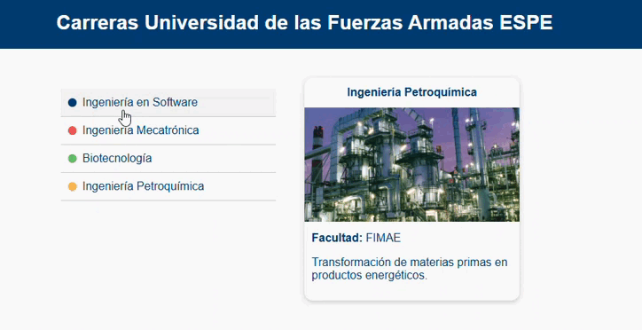

# 🎓 Carreras ESPE - Web Components con LitElement

**Autor:** Alexander Quizhpe Cuzme  
**Carrera:** Tecnologías de la Información  

## Descripción del Proyecto

Este proyecto es una aplicación web interactiva desarrollada con **LitElement**. Consiste en dos Web Components personalizados:

- `<career-selector>`: muestra una lista de carreras disponibles en la ESPE.
- `<career-card>`: muestra los detalles de la carrera seleccionada, con un diseño temático basado en el último dígito de la cédula.

Se evaluó la arquitectura de componentes, el manejo de eventos personalizados, la comunicación entre componentes y el uso de estilos dinámicos basados en datos.

---

## Instrucciones de Instalación

### Clonar el repositorio

```bash
git clone https://github.com/Alexmig24/u2_examen_webComponents/tree/career-selector.js
cd u2_examen_webcomponents
```

### 📦 Instalar dependencias

```bash
npm install
```

### ▶ Ejecutar el proyecto

```bash
npm run serve
```

Esto abrirá la aplicación en `http://localhost:8080`.

---

## Tabla de Props

### `<career-card>`

| Propiedad         | Tipo     | Descripción                                           |
|------------------|----------|-------------------------------------------------------|
| `carrera`         | `Object` | Objeto con los datos de la carrera seleccionada.     |
| `cedulaLastDigit` | `Number` | Último dígito de la cédula, usado para aplicar tema. |

### `<career-selector>`

| Propiedad   | Tipo    | Descripción                                          |
|-------------|---------|------------------------------------------------------|
| `carreras`  | `Array` | Lista de objetos carrera cargados desde un archivo JSON. |

Este componente emite el evento personalizado `career-selected`, que incluye los datos de la carrera seleccionada en `event.detail`.

---

## Vista previa del funcionamiento



Funcionamiento de los componentes creados (relacion card y select)

---

## Estructura del Proyecto

```
/public
  └── carreras.json
/preview
  └── captura-proyecto.png
/src
  ├── index.js
  ├── components/
  │   ├── career-card.js
  │   └── career-selector.js
  ├── styles/
  │   └── themes.js
index.html
webpack.config.js
README.md
```

---

## Tecnologías Utilizadas

- LitElement
- JavaScript (ES Modules)
- Webpack
- HTML/CSS moderno

---